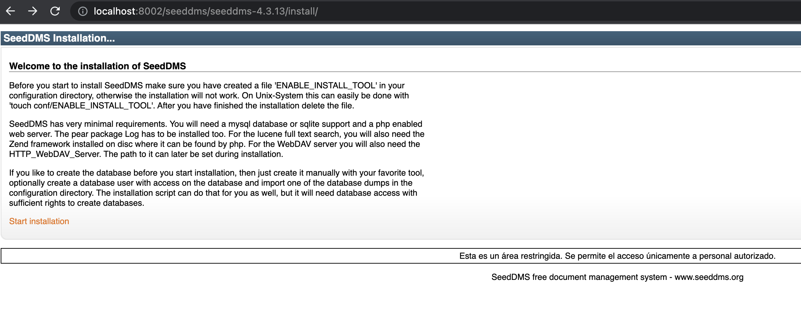
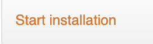
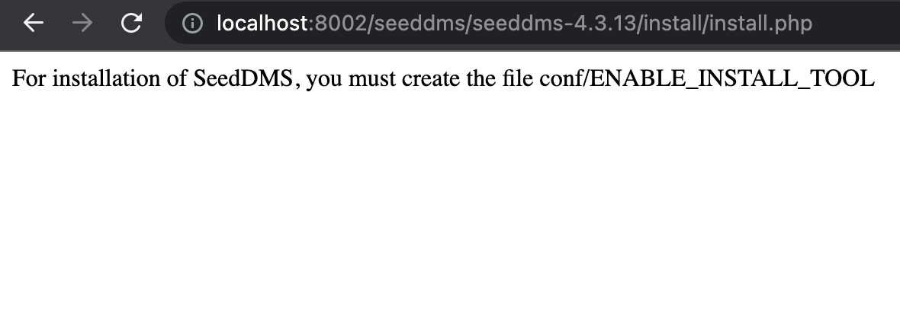
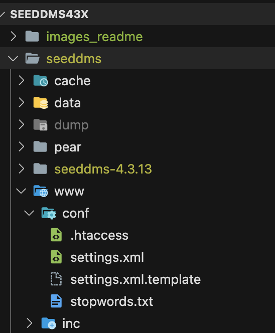
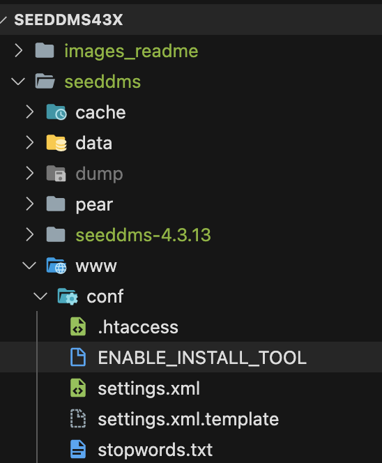
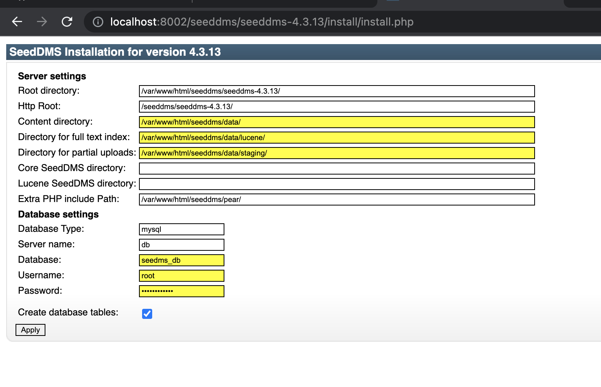
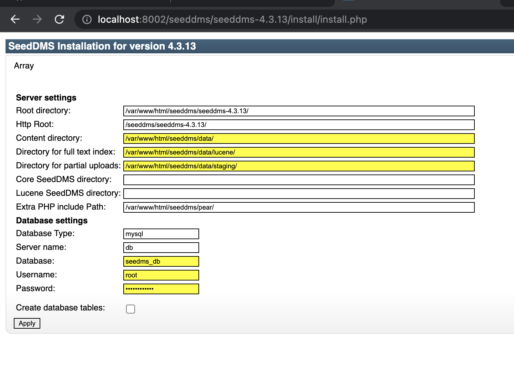
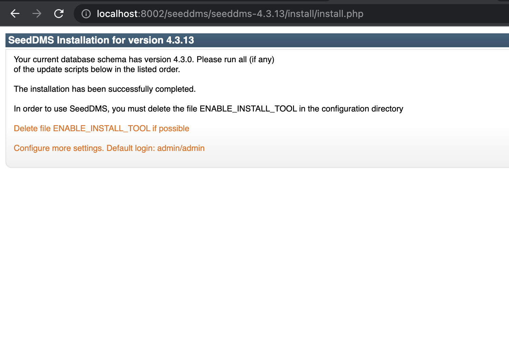
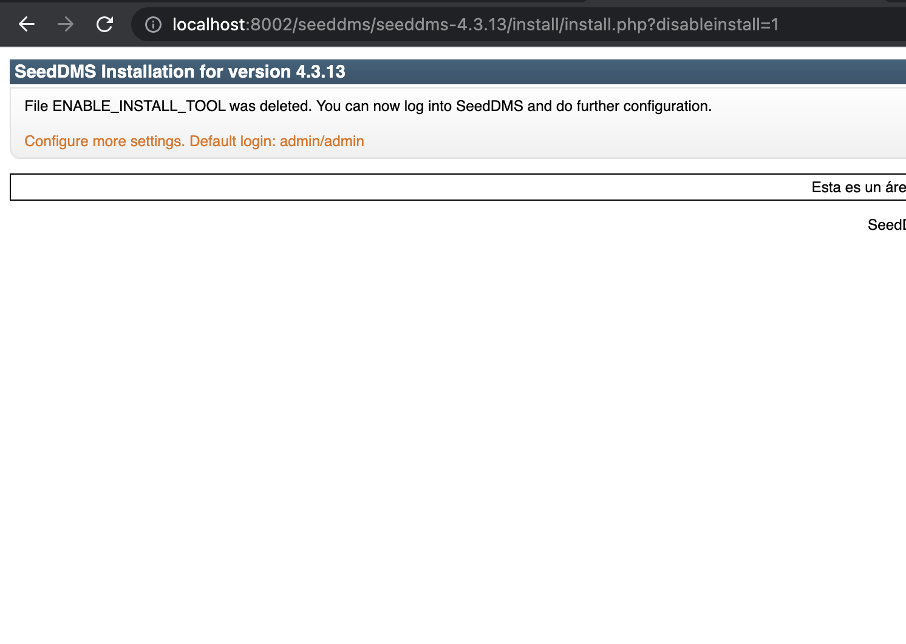
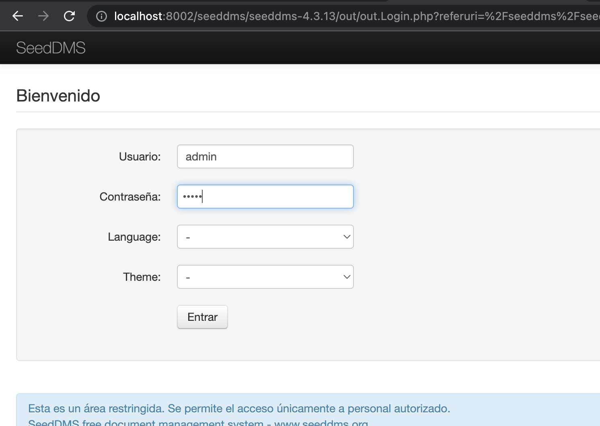

# Seeddms 4.3.13 (IIEG)

## Installation
<hr>

1.- Run the app with docker compose:
In console terminal run the command below
```
docker-compose up
```

2.- Go to the next path on a browser:
```http://localhost:8002/seeddms/seeddms-4.3.13/install/```
this will open the seeddms installation.

<p>
  
</p>

3.- Click on Start installation:
<p>
  
</p>

4.- The next page appears with the next message:

<p>
  
</p>

5.- Create a file named ```ENABLE_INSTALL_TOOL``` inside the directory ```conf``` ( /seeddms/www/conf/):
<p>
  
  
</p>

6.- Refresh the page below with <kbd>F5</kbd> on keybaord:
<p>
  
</p>

7.- The next page will appear:

<p>
  
</p>

8.- Click on ```Create database tables``` checkbox button and then click on ```Apply button```

<p>
  
</p>

9.- The next message appears

<p>
  
</p>

10.- Click again the button Apply ```without``` select checkbox ```Create database tables``` the next page will open:
<p>
  
</p>

11.- Click on ```Delete file ENABLE_INSTALL_TOOl``` this will erase the file created inside the directory conf:

12.- Click on ```Configure more setting. Defaul login: admin/admin```:

<p>
  
</p>

13.- The login page will appear:

<p>
  
</p>
<br>

## User admin 
<hr>

<p>username : admin</p>
<p>password : admin</p>

